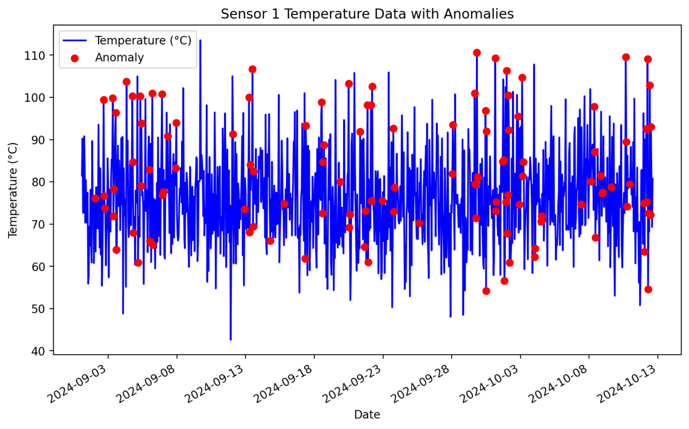
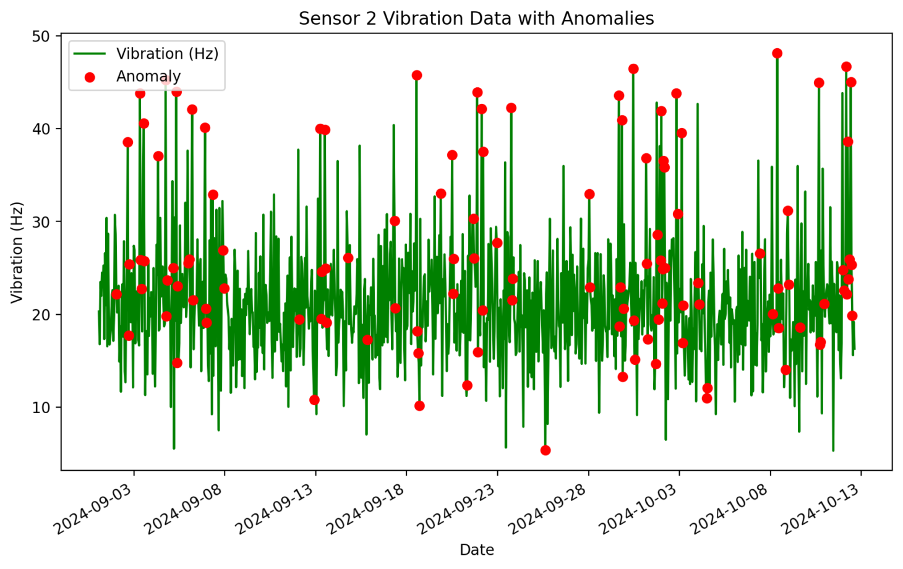
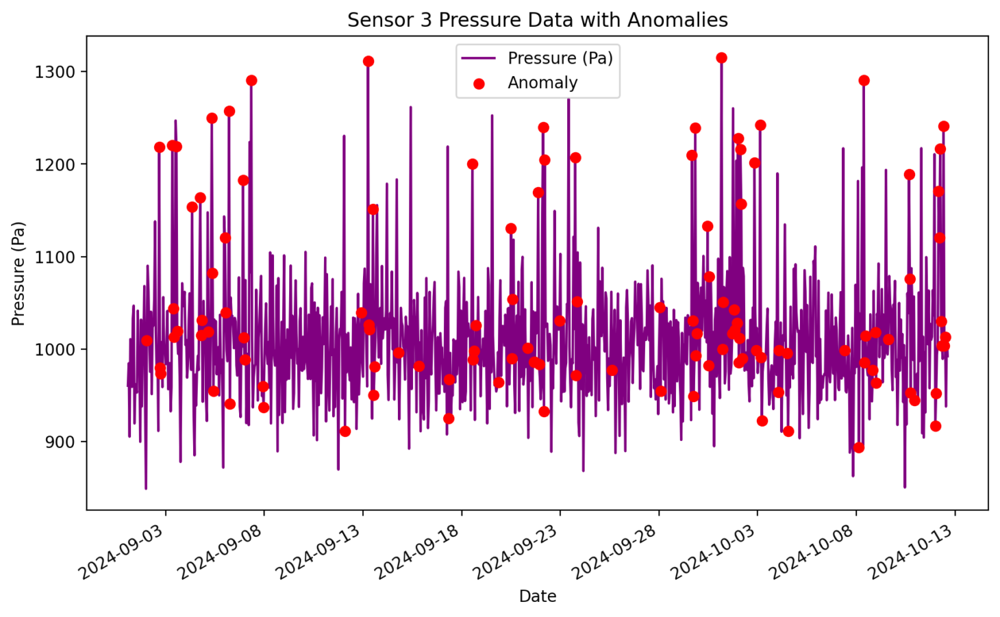

# 故障予測デモアプリ

## 概要

このリポジトリは、機械学習モデル（Isolation Forest）と LLM を組み合わせた故障予測デモアアプリケーションです。  
本アプリケーションでは、センサーデータをアップロードすると、機械学習モデルが異常を検知してその結果を可視化することができます。  
また、LLM を利用して異常検知結果に基づいたレポートを作成します。

## 主な機能
- 異常検知モデルに関する機能
    - Isolation Forest モデルの学習
    - 学習済みモデルの保存
-   Streamlit を使用したデモアプリケーション
    -   センサーデータ（温度、振動、圧力）の CSV ファイルアップロード
    -   温度、振動、圧力データの異常箇所を強調したグラフ表示
    -   LLM を使用した故障の予測に関するレポートの自動生成
    -   異常検知結果と故障予測レポートのダウンロード

## 機械学習モデルの概要

このアプリケーションでは、**Isolation Forest**という機械学習アルゴリズムを使用して異常検知を行います。異常検知は、機器のセンサーデータに基づいて異常なパターンを検出します。

### Isolation Forest
Isolation Forest（アイソレーションフォレスト）は、**異常検知に特化した教師なし学習アルゴリズム**です。Isolation Forestは、以下の特徴を持っています。

- **高速かつ軽量**: ランダムに選んだ特徴量を使ってデータを分割するため、計算コストが低く、異常検知に適しています。
- **異常なデータの分離**: 異常なデータは、通常のデータと比べてランダムに選ばれた特徴量によって早期に分離されやすいため、異常の検出に向いています。
- **教師なし学習**: 異常であるかどうかを示すラベル付きのデータがなくても学習が可能です。

Isolation Forestは、ランダムに分割した木（決定木）の深さに基づいて、データが異常かどうかを評価します。異常なデータは浅いレベルで分離されやすく、木の深さが浅いほど、そのデータは異常と見なされます。

### モデルのトレーニング
このデモにおいて、モデルは以下の手順でトレーニングされています。

1. **センサーデータの前処理**:
   - センサーデータの移動平均を計算し、ノイズを除去して滑らかにします。
   - その後、特徴量として温度、振動、圧力の移動平均データを使用します。

2. **Isolation Forestモデルの訓練**:
   - 特徴量を基に、Isolation Forestモデルを訓練し、正常データと異常データを分離するルールを学習します。

3. **異常の検出**:
   - 訓練されたモデルを用いて、新たなセンサーデータが入力された際に異常を検出します。
   - 出力結果は、`1`（正常）または `-1`（異常）として示され、異常が検出された場合には「異常」として結果が表示されます。

### モデルの使用方法

アプリケーション内で使用されているIsolation Forestモデルは、事前に学習済みのモデルファイル (`isolation_forest_model.pkl`) をロードして異常検知に利用しています。

- **センサーデータのアップロード**: ユーザーはCSV形式のセンサーデータをアップロードし、モデルに対して予測を行います。
- **異常検知の結果**: モデルがセンサーデータの各時点で異常を検出した場合、その結果はグラフ上で赤い点として表示され、詳細なレポートが生成されます。

### 使用されているデータ
以下の3つのセンサーから取得されるデータを基に、異常検知が行われます。

- `Sensor1_Temperature_C`: センサー1の温度データ（単位: °C）
- `Sensor2_Vibration_Hz`: センサー2の振動データ（単位: Hz）
- `Sensor3_Pressure_Pa`: センサー3の圧力データ（単位: Pa）

## セットアップ手順

1. 必要な依存関係をインストールします:

    ```bash
    poetry install
    ```

2. Azure OpenAI の API キーとエンドポイントを .env に記載します。

    ```bash
    AZURE_OPENAI_API_KEY=your-api-key
    AZURE_OPENAI_ENDPOINT=your-endpoint
    AZURE_OPENAI_DEPLOYMENT_NAME=your-deployment-name
    ```

3. アプリケーションを起動します:
    ```bash
    streamlit run app/app.py
    ```

## 使い方

1. アプリケーションを起動したら、`CSVファイルをアップロードしてください`ボタンからデモ用センサーデータ `demo_date.csv` をアップロードします。自身でデータを用意する場合は、以下のカラムが含まれている必要があります:

    - `Timestamp`: タイムスタンプ
    - `Sensor1_Temperature_C`: センサー 1 の温度データ（°C）
    - `Sensor2_Vibration_Hz`: センサー 2 の振動データ（Hz）
    - `Sensor3_Pressure_Pa`: センサー 3 の圧力データ（Pa）

2. アップロードが完了すると、異常検知の結果が表示されます。異常が検出された箇所はグラフ上で赤色で強調表示されます。

3. 異常検知の結果に基づいて、LLM が故障予測についてのレポートを生成し、表示します。

4. 異常検知の結果を CSV ファイルとしてダウンロードすることができます。

## ディレクトリ構成
```
├── app/                  # メインアプリケーション
├── models/               # 異常検知モデルの学習プログラムや学習済みモデルデータ
├── data/                 # 学習用データ
├── .env                  # Envファイル (自身で作成する)
├── demo_data.csv         # デモ用サンプルデータ
├── poetry.lock
├── pyproject.toml
└── README.md
```

### サンプルデータ

このアプリケーションでは、デモ用のセンサーデータとして `demo_data.csv` を提供しています。このCSVファイルには、以下のセンサー情報が含まれており、異常検知を行う際に使用されます。

#### サンプルデータ形式

| Timestamp           | Sensor1_Temperature_C | Sensor2_Vibration_Hz | Sensor3_Pressure_Pa |
|---------------------|-----------------------|----------------------|---------------------|
| 2024-09-02 01:00:00 | 76.11                 | 22.18                | 1009.19             |
| 2024-09-02 16:00:00 | 99.46                 | 38.54                | 1218.07             |
| 2024-09-03 08:00:00 | 99.81                 | 43.80                | 1220.10             |
| 2024-09-03 09:00:00 | 71.91                 | 25.86                | 1043.72             |
| 2024-09-03 13:00:00 | 96.37                 | 40.55                | 1218.94             |

#### 各カラムの説明

- **Timestamp**: データが記録された日時を示します。形式は `YYYY-MM-DD HH:MM:SS` です。
- **Sensor1_Temperature_C**: センサー1で記録された温度データを表します。単位は摂氏度（°C）です。
- **Sensor2_Vibration_Hz**: センサー2で記録された振動データを表します。単位はヘルツ（Hz）です。
- **Sensor3_Pressure_Pa**: センサー3で記録された圧力データを表します。単位はパスカル（Pa）です。

#### データの使用方法
サンプルデータは、実際のセンサーデータを模倣したものであり、異常検知のデモンストレーションに使用されます。このデータをアプリケーションにアップロードすることで、モデルが異常箇所を検出し、異常が発生した時間とその詳細な内容を可視化します。また、異常検知結果に基づいて、故障予測レポートが自動生成されます。

サンプルデータをカスタマイズする場合は、以下のカラム構成に従ってください。


## 実行例
以下は、センサーデータの可視化と異常検知結果の例です:






LLMによって生成された故障レポートの例です:
```
# 機器の故障予測レポート

## 概要
このレポートは、提供された異常データに基づいて機器の故障の可能性とその理由について分析したものです。異常データは、温度、振動、圧力の各センサーの値とその移動平均（MA）、および異常検知結果を含んでいます。

## 異常の概要
異常データは以下の条件に基づいて分類されました：
- **温度異常**: 温度が90°Cを超える場合
- **振動異常**: 振動が30Hzを超える場合
- **圧力異常**: 圧力が1200Paを超える場合

## 異常の詳細
以下は、異常が発生した日時とその詳細です：

| Timestamp           | 温度 (°C) | 振動 (Hz) | 圧力 (Pa) | 異常の種類       |
|---------------------|------------|------------|------------|------------------|
| 2024-09-02 16:00:00 | 99.46      | 38.54      | 1218.07    | 温度、振動、圧力 |
| 2024-09-03 08:00:00 | 99.81      | 43.80      | 1220.10    | 温度、振動、圧力 |
| 2024-09-03 13:00:00 | 96.37      | 40.55      | 1218.94    | 温度、振動、圧力 |
| 2024-09-04 08:00:00 | 103.77     | 37.07      | 1153.59    | 温度、振動       |
| 2024-09-04 18:00:00 | 100.25     | 45.27      | 1163.90    | 温度、振動       |
| 2024-09-05 08:00:00 | 100.32     | 43.96      | 1249.49    | 温度、振動、圧力 |
| 2024-09-06 05:00:00 | 100.92     | 42.08      | 1257.56    | 温度、振動、圧力 |
| 2024-09-06 22:00:00 | 100.72     | 40.11      | 1182.46    | 温度、振動       |
| 2024-09-07 08:00:00 | 90.83      | 32.91      | 1290.33    | 温度、振動、圧力 |
| 2024-09-13 06:00:00 | 99.99      | 40.00      | 1311.03    | 温度、振動、圧力 |
| 2024-09-18 13:00:00 | 98.86      | 45.75      | 1200.44    | 温度、振動、圧力 |
| 2024-09-21 21:00:00 | 98.20      | 43.93      | 1169.24    | 温度、振動       |
| 2024-09-22 05:00:00 | 102.61     | 37.49      | 1204.56    | 温度、振動、圧力 |
| 2024-09-23 18:00:00 | 92.63      | 42.25      | 1207.09    | 温度、振動、圧力 |
| 2024-09-29 20:00:00 | 110.60     | 40.94      | 1238.77    | 温度、振動、圧力 |
| 2024-09-30 11:00:00 | 96.85      | 46.45      | 1132.77    | 温度、振動       |
| 2024-10-01 04:00:00 | 109.31     | 36.81      | 1314.74    | 温度、振動、圧力 |
| 2024-10-02 00:00:00 | 106.27     | 41.91      | 1227.67    | 温度、振動、圧力 |
| 2024-10-02 20:00:00 | 95.46      | 43.80      | 1201.46    | 温度、振動、圧力 |
| 2024-10-03 03:00:00 | 104.68     | 39.52      | 1242.28    | 温度、振動、圧力 |
| 2024-10-08 09:00:00 | 97.81      | 48.11      | 1290.33    | 温度、振動、圧力 |
| 2024-10-10 16:00:00 | 109.52     | 44.95      | 1188.95    | 温度、振動       |
| 2024-10-12 06:00:00 | 109.05     | 38.62      | 1216.57    | 温度、振動、圧力 |
| 2024-10-12 10:00:00 | 102.90     | 45.02      | 1240.84    | 温度、振動、圧力 |

## 故障の可能性
機器が故障する可能性が高いとされる条件は、24時間以内に5回以上異常が発生することです。以下の期間において、この条件を満たす異常が確認されました：

### 2024-09-02 16:00:00 から 2024-09-03 16:00:00
- 異常回数: 6回
- 異常の詳細:
  - 2024-09-02 16:00:00
  - 2024-09-02 17:00:00
  - 2024-09-02 18:00:00
  - 2024-09-03 08:00:00
  - 2024-09-03 09:00:00
  - 2024-09-03 10:00:00

### 2024-09-03 08:00:00 から 2024-09-04 08:00:00
- 異常回数: 6回
- 異常の詳細:
  - 2024-09-03 08:00:00
  - 2024-09-03 09:00:00
  - 2024-09-03 10:00:00
  - 2024-09-03 13:00:00
  - 2024-09-03 14:00:00
  - 2024-09-04 08:00:00

### 2024-09-04 08:00:00 から 2024-09-05 08:00:00
- 異常回数: 6回
- 異常の詳細:
  - 2024-09-04 08:00:00
  - 2024-09-04 18:00:00
  - 2024-09-04 19:00:00
  - 2024-09-04 20:00:00
  - 2024-09-05 04:00:00
  - 2024-09-05 08:00:00

### 2024-09-05 08:00:00 から 2024-09-06 08:00:00
- 異常回数: 6回
- 異常の詳細:
  - 2024-09-05 08:00:00
  - 2024-09-05 09:00:00
  - 2024-09-05 10:00:00
  - 2024-09-06 00:00:00
  - 2024-09-06 01:00:00
  - 2024-09-06 05:00:00

### 2024-09-06 05:00:00 から 2024-09-07 05:00:00
- 異常回数: 5回
- 異常の詳細:
  - 2024-09-06 05:00:00
  - 2024-09-06 06:00:00
  - 2024-09-06 22:00:00
  - 2024-09-06 23:00:00
  - 2024-09-07 00:00:00

### 2024-09-12 04:00:00 から 2024-09-13 04:00:00
- 異常回数: 5回
- 異常の詳細:
  - 2024-09-12 04:00:00
  - 2024-09-12 05:00:00
  - 2024-09-12 06:00:00
  - 2024-09-12 07:00:00
  - 2024-09-12 08:00:00

### 2024-09-29 16:00:00 から 2024-09-30 16:00:00
- 異常回数: 6回
- 異常の詳細:
  - 2024-09-29 16:00:00
  - 2024-09-29 17:00:00
  - 2024-09-29 18:00:00
  - 2024-09-29 20:00:00
  - 2024-09-29 21:00:00
  - 2024-09-29 22:00:00

### 2024-10-01 04:00:00 から 2024-10-02 04:00:00
- 異常回数: 5回
- 異常の詳細:
  - 2024-10-01 04:00:00
  - 2024-10-01 05:00:00
  - 2024-10-01 06:00:00
  - 2024-10-01 17:00:00
  - 2024-10-01 19:00:00

### 2024-10-02 00:00:00 から 2024-10-03 00:00:00
- 異常回数: 6回
- 異常の詳細:
  - 2024-10-02 00:00:00
  - 2024-10-02 01:00:00
  - 2024-10-02 02:00:00
  - 2024-10-02 03:00:00
  - 2024-10-02 04:00:00
  - 2024-10-02 05:00:00

### 2024-10-12 00:00:00 から 2024-10-13 00:00:00
- 異常回数: 6回
- 異常の詳細:
  - 2024-10-12 00:00:00
  - 2024-10-12 01:00:00
  - 2024-10-12 04:00:00
  - 2024-10-12 05:00:00
  - 2024-10-12 06:00:00
  - 2024-10-12 07:00:00

## 結論
提供されたデータに基づき、機器は複数の期間において24時間以内に5回以上の異常が発生しており、故障の可能性が高いと判断されます。特に温度、振動、圧力の異常が同時に発生している場合、機器の故障リスクがさらに高まります。これらの異常が継続する場合、早急な点検と修理が必要です。
```